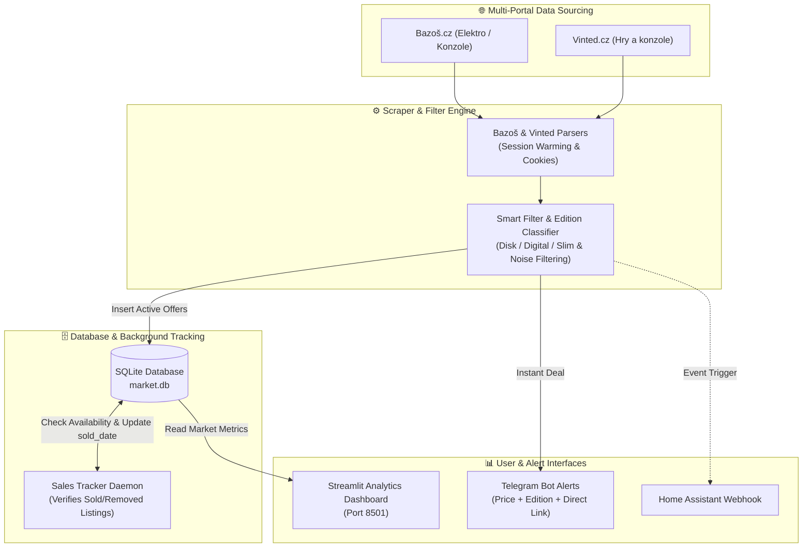

# 🎮 PlayStation 5 Arbitrage Scraper & Market Analytics

[](https://www.python.org/)
[](https://www.docker.com/)
[](https://streamlit.io/)
[](https://www.sqlite.org/)
[](https://www.raspberrypi.com/)
[](LICENSE)

An end-to-end market intelligence, automated deal-hunter, and sales velocity tracker for second-hand **Sony PlayStation 5 consoles** across **Bazoš.cz** and **Vinted.cz**. 

The system collects real-time market offers, categorizes them by edition (**Disk**, **Digital**, and **Slim** variants) into a local **SQLite** database, tracks price movements and sales velocity (`days_to_sell`), triggers instant **Telegram** notifications for below-market arbitrage deals, and serves an interactive **Streamlit** analytics dashboard.

Optimized to run 24/7 on a home server such as **Raspberry Pi 4** or Linux server using Docker Compose.

---

## 🎯 Business Context & Arbitrage Strategy

In the second-hand gaming console market, PlayStation 5 consoles command high resale liquidity and predictable market prices. Profitable console flipping requires two critical pieces of information:
1. **True Fair Market Value**: What is the historical median selling price for a specific edition (e.g., *PS5 Disk Edition* vs. *PS5 Slim Digital*)?
2. **Sales Velocity (Liquidity)**: Which console offers sell out within hours versus those that stay listed for weeks?

This project automates the entire arbitrage research loop:
- **Instant Telegram Deal Alerts**: Notifies immediately when an offer is priced below market median with high estimated profit.
- **Automated Sales Tracking**: Periodically verifies whether active listings have been sold or removed, calculating exact turnover speed.
- **Visual Pricing Dashboard**: Enables deep-dive analytics into market trends, price distribution, edition breakdown, and current arbitrage opportunities via a modern web interface.

---

## 🏗 System Architecture



---

## ✨ Key Features

### 1. Dual-Portal Scraping
- **Bazoš.cz**: Monitors the console category for PS5 search queries with polite pagination and resilient error handling.
- **Vinted.cz**: Emulates modern desktop browser headers and session cookies using TLS impersonation (`curl_cffi`) to reliably query Vinted catalog listings.
- **Polite Crawling**: Employs randomized intervals (`SCRAPE_INTERVAL_MIN` to `SCRAPE_INTERVAL_MAX`) to prevent rate-limiting.

### 2. Intelligent Edition Classification, Storage Detection & Anti-Noise Filtering
- **Gemini 3.5 Flash Lite LLM Validation (`google-genai v2.23.0`)**:
  - Enforced structured JSON output via `types.GenerateContentConfig(response_schema=...)`.
  - **Storage Capacity Detection**: Automatically identifies storage size (e.g. `825GB` for original Fat models, `1TB` for Slim models) and appends it to clean titles (e.g. *PlayStation 5 Slim 1TB*).
  - **Automated API Key Rotation**: Supports comma-separated API keys (`GEMINI_API_KEY="key1,key2"`). When reaching daily quota/rate limits (`429`, `quota`, `exhausted`), it automatically switches to the next available key with full diagnostic logging.
  - **Resilient Offline Fallback**: If Gemini keys are omitted or all fail, gracefully falls back to deterministic keyword filtering.
- **Automated Edition Detection**: Categorizes listings into **Disk**, **Digital**, and identifies the **Slim** variant:
  - *Digital Edition*: keywords like `digital`, `digitální`, `bez mechaniky`
  - *Disk Edition*: keywords like `disk`, `disc`, `mechanik`, `blu-ray`
  - *Slim Variant*: detection of `slim`
  - *Conservative Fallback*: Unknown editions benchmark against Digital median for profit calculations.
- **Aggressive Noise Blacklisting**: Eliminates accessories and non-console listings:
  - Controllers (*ovladač, DualSense*)
  - Accessories & Peripherals (*headset, sluchátka, stojan, kryt, kabel, volant, VR2*)
  - Games (*hry, game, games*)
  - Broken units (*rozbité, nefunkční, na díly*)
  - Rental & Wanted queries (*pronájem, půjčím, hledám, koupím, vyměním*)
  - Other console platforms (*PS4, Xbox, Nintendo Switch*)
  - Price guards: 3,000 Kč – 13,500 Kč window.

### 3. Sales Tracker & Liquidity Analysis
- A dedicated background daemon (`tracker.py`) periodically crawls active listings stored in the database.
- Detects when an item is sold, deleted, or removed, and records the exact timestamp.
- Calculates turnover duration to reveal market liquidity.

### 4. Telegram Deal Alerts
- Sends instant notifications containing console edition, price, location, description snippet, and direct link.
- Computes estimated profit margin based on current edition medians.
- Supports optional integration with **Home Assistant** via webhooks.

### 5. Streamlit Analytics Dashboard
- Hosted at `http://<your-ip>:8501`.
- **KPI Overview**: Total tracked consoles, active vs. sold ratio, average selling speed, and median market prices.
- **Arbitrage Scanner**: Real-time table of underpriced active offers ranked by potential profit.
- **Interactive Plotly Visualizations**: Price distribution boxplots by edition, sales velocity correlation, and volume breakdown.

---

## 📁 Repository Structure

```
.
├── .agyrules                    # Autonomous swarm workflow rules
├── .gitignore                   # Ignores secrets (.env), DBs (*.db), caches
├── README.md                    # Project documentation
├── scraper/
│   ├── main.py                  # Main execution loop & tracker lifecycle
│   ├── scraper.py               # Bazoš.cz scraper
│   ├── vinted_scraper.py        # Vinted.cz scraper
│   ├── filter.py                # PS5 edition classifier, whitelist & anti-noise filter
│   ├── db.py                    # SQLite schema, migrations & CRUD operations
│   ├── tracker.py               # Sales tracker daemon (status & liquidity)
│   ├── notifier.py              # Telegram & Home Assistant notification logic
│   ├── test_scraper.py          # Unit tests for Bazoš parsing
│   ├── test_vinted_scraper.py   # Unit tests for Vinted parsing
│   ├── test_filter.py           # Unit tests for PS5 filtering & validation
│   ├── test_db.py               # Unit tests for SQLite operations
│   ├── test_tracker.py          # Unit tests for availability tracker
│   ├── test_notifier.py         # Unit tests for alerts
│   ├── test_main.py             # Integration tests for execution cycle
│   └── fixtures/                # Local HTML mock files for unit tests
│       ├── bazos_search.html    # Bazoš PS5 search fixture
│       └── vinted_ps5.html      # Vinted PS5 catalog fixture
├── dashboard/
│   ├── __init__.py
│   ├── app.py                   # Streamlit web application
│   ├── analytics.py             # Aggregations, KPIs & arbitrage calculations
│   └── test_analytics.py        # Unit tests for dashboard metrics
└── deploy/
    ├── Dockerfile               # Multi-purpose slim Docker image (scraper/dashboard)
    ├── docker-compose.yml       # Production Compose (2 services + shared volume)
    ├── requirements.txt         # Production dependencies (Pandas, Plotly, Streamlit...)
    ├── .env.example             # Template for configuration
    └── .env                     # Local secrets (NEVER committed)
```

---

## 🚀 Getting Started

### 1. Prerequisites

- **Docker & Docker Compose** installed.
- **Telegram Bot Token** (obtained from [@BotFather](https://t.me/BotFather)).
- Target **Telegram Chat ID**.

### 2. Configuration (`.env`)

Create your `.env` file in `deploy/`:

```bash
cp deploy/.env.example deploy/.env
```

Edit `deploy/.env` with your values:

```ini
COMPOSE_PROJECT_NAME=ps5
TELEGRAM_TOKEN=1234567890:ABCdefGHIjklMNOpqrSTUvwxYZ
TELEGRAM_CHAT_IDS=123456789

# Optional Gemini LLM Validation & Key Rotation (comma-separated):
GEMINI_API_KEY=your_key_1,your_key_2

SCRAPE_INTERVAL_MIN=120
SCRAPE_INTERVAL_MAX=300
VINTED_ENABLED=true
LOG_LEVEL=INFO

# Optional Home Assistant Webhook:
# HA_WEBHOOK_URL=http://homeassistant.local:8123/api/webhook/ps5_alert
```

---

## 🐳 Deployment (Docker Compose)

The deployment spins up two isolated services connected via a shared persistent volume `ps5_data`:
1. `ps5-scraper`: Runs the 24/7 scraping loop and background sales tracker.
2. `ps5-dashboard`: Serves the Streamlit web dashboard on port `8501`.

```bash
# Navigate to the deploy directory
cd deploy

# Build and start all services in detached mode
docker compose up -d --build

# View real-time scraper logs
docker compose logs -f ps5-scraper

# View dashboard logs
docker compose logs -f ps5-dashboard
```

### Accessing the Dashboard

Open your browser and navigate to:
```
http://<SERVER_IP>:8501
```

> **Data Persistence:** The SQLite database (`market.db`) and `seen_ids.json` are stored in the Docker volume `ps5_data` mapped to `/data`.

---

## 🧪 Local Testing & TDD

All test suites run deterministically against local mock fixtures in `scraper/fixtures/` without pinging external websites.

```bash
# Run all unit and integration tests
pytest scraper/ dashboard/ -v

# Run specific suite
pytest scraper/test_filter.py -v
pytest dashboard/test_analytics.py -v
```

---

## 📊 Database Schema Summary

The SQLite database (`market.db`) maintains structured records for comprehensive analytical reporting:

| Field | Type | Description |
| :--- | :--- | :--- |
| `db_id` | INTEGER PRIMARY KEY | Autoincrement internal ID |
| `item_id` | TEXT UNIQUE | Unique portal item ID (`<id>` or `vt_<id>`) |
| `portal` | TEXT | Source platform (`bazos` or `vinted`) |
| `title` | TEXT | Original listing title |
| `edition` | TEXT | PS5 edition (`Disk`, `Digital`, `Unknown`) |
| `is_slim` | BOOLEAN | Whether console is the Slim model (0/1) |
| `price` | INTEGER | Price in CZK |
| `url` | TEXT | Direct link to original listing |
| `found_date` | DATETIME | Initial discovery timestamp |
| `sold_date` | DATETIME | Timestamp when listing was marked sold/removed |
| `status` | TEXT | Status: `active`, `sold`, or `deleted` |

---

## 📄 License

This project is licensed under the MIT License.
