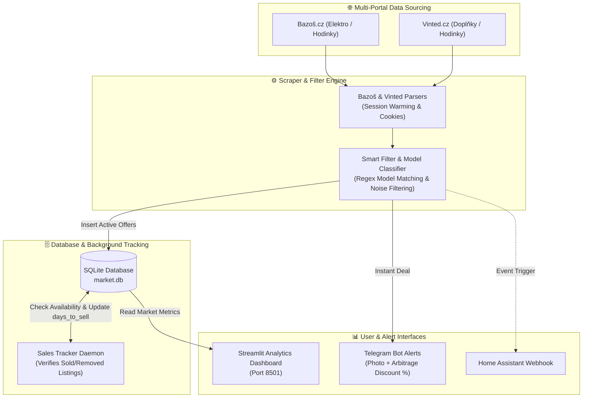

# ⌚ Garmin Watch Arbitrage Scraper & Market Analytics

[](https://www.python.org/)
[](https://www.docker.com/)
[](https://streamlit.io/)
[](https://www.sqlite.org/)
[](https://www.raspberrypi.com/)
[](LICENSE)

An end-to-end market intelligence, automated deal-hunter, and sales velocity tracker for second-hand **Garmin smartwatches** across **Bazoš.cz** and **Vinted.cz**. 

The system collects all real-time market offers, categorizes them by model into a local **SQLite** database, tracks price drops and sales velocity (`days_to_sell`), triggers instant **Telegram** notifications for below-market arbitrage deals, and serves an interactive **Streamlit** analytics dashboard.

Optimized to run 24/7 on a home server such as **Raspberry Pi 4** using Docker Compose.

---

## 🎯 Business Context & Arbitrage Strategy

In the second-hand electronics market, Garmin smartwatches (*Fenix, Epix, Forerunner, Instinct, Venu*) command strong resale liquidity and predictable market value. However, profitable reselling (flipping) requires two critical pieces of information:
1. **True Fair Market Value**: What is the historical average selling price for a specific model (e.g., *Fenix 7 Sapphire Solar* vs. *Forerunner 965*)?
2. **Sales Velocity (Liquidity)**: Which models sell out within 24–48 hours versus those that stagnate for weeks?

This project automates the entire arbitrage research loop:
- **Instant Telegram Deal Alerts**: Notifies immediately when an offer is priced significantly below the model's historical average.
- **Automated Sales Tracking**: Periodically verifies whether active listings have been sold or removed, calculating exact turnover speed.
- **Visual Pricing Dashboard**: Enables deep-dive analytics into market trends, price distribution, and current arbitrage opportunities via a modern web interface.

---

## 🏗 System Architecture



---

## ✨ Key Features

### 1. Dual-Portal Scraping
- **Bazoš.cz**: Monitors the watch category for Garmin search queries with automated pagination and resilient request retries.
- **Vinted.cz**: Emulates modern desktop browser headers and session cookies to reliably query Vinted catalog listings.
- **Polite Crawling**: Employs randomized intervals (`SCRAPE_INTERVAL_MIN` to `SCRAPE_INTERVAL_MAX`) to prevent rate-limiting.

### 2. Intelligent Model Classification & Heuristic Filtering
- **Automated Model Extraction**: Uses clean regex matching to identify models regardless of seller formatting typos:
  - *Fenix Series* (5, 6, 7, 8, Pro, Sapphire, Solar, X, S)
  - *Epix Series* (Gen 2, Pro)
  - *Forerunner Series* (45, 55, 165, 245, 255, 265, 745, 945, 955, 965)
  - *Instinct Series* (1, 2, 2X, Crossover, Solar)
  - *Venu & Vivoactive Series* (Venu Sq/2/3, Vivoactive 3/4/5)
  - *Specialty Series* (Enduro, Tactix, Descent, Marq)
- **Aggressive Noise Blacklisting**: Eliminates false positives such as straps/bands (*řemínek, pásek*), chargers & docks (*nabíječka, kabel*), protective glass/cases (*ochranné sklo, obal, pouzdro*), and defective devices (*na náhradní díly, nefunkční, prasklý*).

### 3. Sales Tracker & Liquidity Analysis
- A dedicated background daemon (`tracker.py`) periodically crawls active listings stored in the database.
- Detects when an item is sold, deleted, or removed, and records the exact timestamp.
- Calculates **`days_to_sell`** to reveal model liquidity (e.g., *Forerunner 265 sells on average in 1.8 days, while older Fenix 5 stays active for 14+ days*).

### 4. Telegram Deal Alerts
- Sends instant notifications containing watch photo, price, model classification, market comparison, and direct link.
- Computes estimated arbitrage profit (e.g., *"35% below historical market average"*).
- Supports optional integration with **Home Assistant** via webhooks.

### 5. Streamlit Analytics Dashboard
- Hosted at `http://<your-ip>:8501`.
- **KPI Overview**: Total tracked watches, active vs. sold ratio, average days to sell, and median discount.
- **Arbitrage Scanner**: Real-time table of underpriced active offers ranked by potential profit.
- **Interactive Plotly Visualizations**: Price distribution boxplots, sales velocity vs. price correlation, and model volume breakdown.

---

## 📁 Repository Structure

```
.
├── .gitignore                   # Ignores secrets (.env), DBs (*.db), caches
├── README.md                    # Project documentation
├── scraper/
│   ├── __init__.py
│   ├── main.py                  # Main execution loop & tracker lifecycle
│   ├── scraper.py               # Bazoš.cz scraper
│   ├── vinted_scraper.py        # Vinted.cz scraper
│   ├── filter.py                # Model classifier, whitelist & noise filter
│   ├── db.py                    # SQLite schema, migrations & CRUD operations
│   ├── tracker.py               # Sales tracker daemon (status & liquidity)
│   ├── notifier.py              # Telegram & Home Assistant notification logic
│   ├── test_scraper.py          # Unit tests for Bazoš parsing
│   ├── test_vinted_scraper.py   # Unit tests for Vinted parsing
│   ├── test_filter.py           # Unit tests for model detection & filtering
│   ├── test_db.py               # Unit tests for SQLite operations
│   ├── test_tracker.py          # Unit tests for availability tracker
│   ├── test_notifier.py         # Unit tests for alerts
│   ├── test_main.py             # Integration tests for execution cycle
│   └── fixtures/                # Local HTML mock files for unit tests
│       ├── bazos_search.html
│       └── vinted_garmin.html
├── dashboard/
│   ├── __init__.py
│   ├── app.py                   # Streamlit web application
│   ├── analytics.py             # Aggregations, KPIs & arbitrage calculations
│   └── test_analytics.py        # Unit tests for dashboard metrics
└── deploy/
    ├── Dockerfile               # Multi-purpose slim Docker image (scraper/dashboard)
    ├── docker-compose.yml       # Production Compose (2 services + shared volume)
    ├── requirements.txt         # Production dependencies (Pandas, Plotly, Streamlit...)
    ├── .env.example             # Template for configuration
    └── .env                     # Local secrets (NEVER committed)
```

---

## 🚀 Getting Started

### 1. Prerequisites

- **Raspberry Pi 4** (or any Linux/macOS/Windows machine) with Docker & Docker Compose.
- **Telegram Bot Token** (obtained from [@BotFather](https://t.me/BotFather)).
- Your target **Telegram Chat ID**.

### 2. Configuration (`.env`)

Create your `.env` file in `deploy/`:

```bash
cp deploy/.env.example deploy/.env
```

Edit `deploy/.env` with your values:

```ini
# --- Telegram Bot (Required) ---
TELEGRAM_TOKEN=1234567890:ABCdefGHIjklMNOpqrSTUvwxYZ
TELEGRAM_CHAT_IDS=123456789

# --- Scraping Intervals (seconds) ---
SCRAPE_INTERVAL_MIN=120
SCRAPE_INTERVAL_MAX=300

# --- Portals & Integrations ---
VINTED_ENABLED=true
LOG_LEVEL=INFO

# --- Optional Home Assistant Webhook ---
# HA_WEBHOOK_URL=http://homeassistant.local:8123/api/webhook/garmin_alert
```

---

## 🐳 Deployment on Raspberry Pi 4 (Docker Compose)

The deployment spins up two isolated services connected via a shared persistent volume `garmin_data`:
1. `garmin-scraper`: Runs the 24/7 scraping loop and background sales tracker.
2. `garmin-dashboard`: Serves the Streamlit web dashboard on port `8501`.

```bash
# Navigate to the deploy directory
cd deploy

# Build and start all services in detached mode
docker compose up -d --build

# View real-time scraper logs
docker compose logs -f garmin-scraper

# View dashboard logs
docker compose logs -f garmin-dashboard
```

### Accessing the Dashboard

Open your browser and navigate to:
```
http://<RASPBERRY_PI_IP>:8501
```

> **Data Persistence:** The SQLite database (`market.db`) and `seen_ids.json` are stored in the Docker volume `garmin_data` mapped to `/data`. Data persists across container updates, rebuilds, and system reboots.

---

## 🧪 Local Testing & TDD

All test suites run deterministically against local mock fixtures in `scraper/fixtures/` without touching external websites.

### Setting Up a Local Environment

```bash
python -m venv .venv
source .venv/bin/activate   # On Windows: .venv\Scripts\activate
pip install -r deploy/requirements.txt
pip install pytest pytest-mock
```

### Running Tests

```bash
# Run all unit and integration tests
pytest scraper/ dashboard/

# Run specific suite
pytest scraper/test_filter.py
pytest dashboard/test_analytics.py
```

---

## 📊 Database Schema Summary

The SQLite database (`market.db`) maintains structured records for comprehensive analytical reporting:

| Field | Type | Description |
| :--- | :--- | :--- |
| `id` | TEXT PRIMARY KEY | Unique portal item ID (`bazos_<id>` / `vinted_<id>`) |
| `portal` | TEXT | Source platform (`bazos` or `vinted`) |
| `model` | TEXT | Standardized model name (e.g. `Fenix 7 Solar`) |
| `title` | TEXT | Original listing title |
| `price` | REAL | Price converted to CZK |
| `status` | TEXT | Status: `active`, `sold`, or `removed` |
| `scraped_at` | TIMESTAMP | Initial discovery timestamp |
| `sold_at` | TIMESTAMP | Detected sale / removal timestamp |
| `days_to_sell` | REAL | Total days elapsed between discovery and removal |
| `url` | TEXT | Direct link to original listing |

---

## 📄 License

This project is licensed under the MIT License — see the [LICENSE](LICENSE) file for details.
